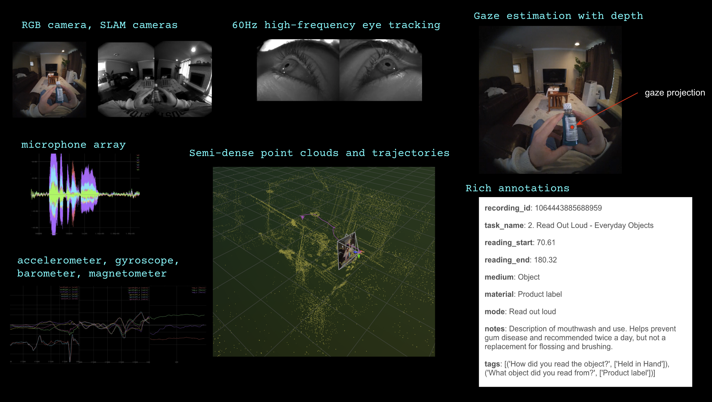
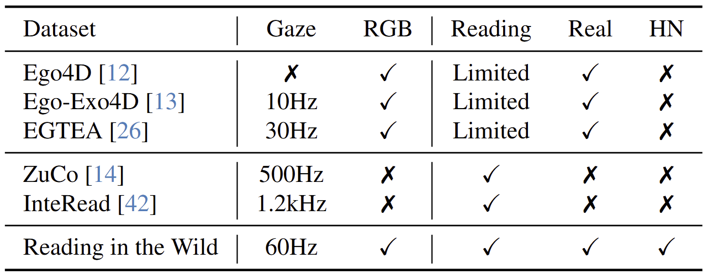

# Reading in the Wild

[[📝 Blogpost]](https://www.projectaria.com/news/introducing-reading-recognition-in-the-wild/)
[[📂 Project Page]](https://www.projectaria.com/datasets/reading-in-the-wild)
[[📊 Data Explorer]](https://explorer.projectaria.com/ritw)
[[📄 Paper]](https://arxiv.org/abs/2505.24848) [[📚 Bibtex]](#attribution)

The Reading in the Wild dataset is the first to feature high-frequency eye-tracking data (60z) with Project Aria glasses. This dataset encompasses 100 hours of reading and non-reading activities captured in diverse and realistic scenarios from 111 participants. It includes three key modalities: egocentric RGB video, eye gaze, and head pose data, along with other sensor data from the Project Aria sensor suite, including audio, IMU, magnetometer, and barometer data. Our dataset is designed for understanding the reading behavior of people in realistic settings in greater detail, with implications for cognitive research.

<p align="center">
  
  
</p>

<p align="center">

</p>

## 🔍 Comparison to Existing Datasets
Compared to existing gocentric video datasets as well as reading datasets, our dataset is the first reading dataset that contains high-frequency eye-gaze, diverse and realistic egocentric videos, and hard negative (HN) samples. 

<p align="center">

</p>

## 🤖 Reading Recognition Model

We have developed a lightweight and flexible model for reading recognition with high precision and recall by utilizing RGB, eye gaze, and head pose data. You can find the reading recognition model in the [[`/models`]](https://github.com/facebookresearch/reading_in_the_wild/tree/main/models) folder. For a comprehensive performance analysis and an overview of the model's capabilities, please refer to our [technical report](https://arxiv.org/abs/2505.24848).

## 🚀 Getting Started

Run the following commands to create a conda environment `ritw` with this
repository installed by pip.

```
   git clone git@github.com:facebookresearch/reading_in_the_wild.git
   cd reading_in_the_wild
   conda create -n ritw python=3.10
   conda activate ritw
   pip install -r requirements.txt
```

## 📦 Download Dataset

The Reading in the Wild dataset contains two distinct subsets, one captured in Columbus and the other captured in Seattle. The Seattle subset focuses on diversity, while the Columbus subset aims to test our model’s ability to generalize in unseen settings, as well as identify edge cases where the model fails. 

Please refer to each folder for instructions on how to download each subset.

### [☕ Seattle Subset](https://github.com/facebookresearch/reading_in_the_wild/tree/main/reading_in_the_wild_seattle)
The Seattle subset was collected for training, validation, and testing purposes. It focuses on reading and non-reading activities in diverse scenarios, meaning it covers a wide variety of participants, reading modes, written materials, and more. It contains a mix of normal negative (no text present) and hard negative (text present but not being read) examples, as well as mixed sequences that alternate between reading and not reading. These data were collected in homes, office spaces, libraries, and the outdoors. This dataset is owned and distributed by Meta under under the Creative Commons Attribution-NonCommercial 4.0 International License (CC BY-NC 4.0). 

### [🎓 Columbus Subset](https://github.com/AIoT-MLSys-Lab/Reading-in-the-Wild-Columbus#)
The Columbus subset was was collected to find cases where models intended to discern whether participants are reading encounter failure points. It contains examples of hard negatives (where text is present but not being read), searching/browsing (which gives confusing gaze patterns), and the reading of non-English texts (where reading direction differs). This dataset is owned and distributed by Ohio State University (OSU). Meta do not host or redistribute the dataset. Please refer to the official OSU repository in the link for access and licensing information.


## License

Reading in the Wild - Seattle Subset dataset and code is released by Meta under the Creative Commons
Attribution-NonCommercial 4.0 International License
([CC BY-NC 4.0](https://creativecommons.org/licenses/by-nc/4.0/legalcode)). Data
and code may not be used for commercial purposes. For more information, please
refer to the [LICENSE](./LICENSE) file included in this repository.

### Attribution

When using the dataset and code, please attribute it as follows:

```
@inproceedings{yang25reading,
      title={Reading Recognition in the Wild},
      author={Charig Yang and Samiul Alam and Shakhrul Iman Siam and Michael Proulx and Lambert Mathias and Kiran Somasundaram and Luis Pesqueira and James Fort and Sheroze Sheriffdeen and Omkar Parkhi and Carl Ren and Mi Zhang and Yuning Chai and Richard Newcombe and Hyo Jin Kim},
      booktitle={arXiv Preprint},
      year={2025},
      url={https://arxiv.org/abs/2505.24848},
}
```

### Contribute

We welcome contributions! Go to [CONTRIBUTING](.github/CONTRIBUTING.md) and our
[CODE OF CONDUCT](.github/CODE_OF_CONDUCT.md) for how to contribute.
