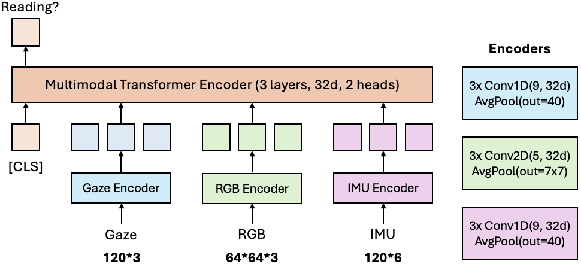
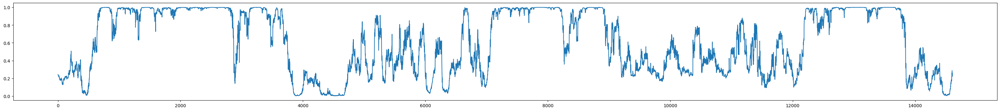

# Reading Recognition in the Wild

We developed a lightweight (only 130K params total), flexible model for reading recognition that achieves high precision and recall. The model leverages a **5&deg; FoV RGB crop** centered on the wearer's eye gaze, **3D gaze velocities** sampled at 60Hz spanning 2s from the eye tracking cameras and **3D head orientation and velocity** sampled at 60Hz spanning 2s from the IMU sensors, **either individually or in combination**. The model is trained on the training split of the Reading in the Wild - Seattle Subset. A comprehensive analysis of its performance and capabilities is provided in our technical report.

<p align="center">

</p>

<p align="center">

</p>

## Prerequisites

To get started, ensure you have the dependencies ([requirements.txt](https://github.com/facebookresearch/reading_in_the_wild/blob/main/requirements.txt)) installed as in [[Getting Started]](https://github.com/facebookresearch/reading_in_the_wild?tab=readme-ov-file#getting-started).


## Demo

[Note: the `demo` folder only include gaze (no IMU and RGB), to save storage. Please download the full dataset to use all of them, or to use `train.py`.]

```bash
python predict.py --use_gaze
```

It should generate a plot like the following for the demo data (x-axis: time (sixtieth of a second), y-axis: confidence score for reading):
<p align="center">

</p>

## Inference

### Arguments

- **Start Time**: Specify the start time in the video (in seconds), for example, to skip eye calibration.
- **Snippet Gap**: Define the time gap between each snippet to do inference (in seconds). The default is set to `1/60` to match a 60Hz gaze frequency.
- **Modality Options**: Choose to use gaze, IMU, and/or RGB data. The model is flexible and can work with any combinations of these modalities.

### Usage

To run the model with all modalities, performing inference at every second, use the following command:

```bash
python predict.py --use_rgb --use_imu --use_gaze --start_time 0 --snippet_gap 1
```

To run the model with gaze only, performing inference at 60Hz, starting from T=60s, use the following command:
```bash
python predict.py --use_gaze --start_time 60 --snippet_gap 0.0166666667
```

### Model variations

The argument `--model_name` has the following components:

- **Choices**: 
  - The `choices` parameter restricts the possible values that `--model_name` can take. The available options are:
    - `v1_default` -- Our best reading recognition model that can take multi-modal inputs with any combinations. 
    - `v1_15Hz` -- with lower frequency (for ablation, might see more attention towards RGB)
    - `v1_1s` -- with lower temporal context, should have better latency
    - `v1_mode` -- reading mode [not reading, out loud, normal, scan, walking , write/type, skim]
    - `v1_medium` -- reading medium [not reading, print, digital, object] (note, we do not use RGB for this option)
    - `v1_large` -- with larger RGB crop
      
- **Default Value**: 
  - The `default` parameter sets the default value for `--model_name` if the user does not provide one. In this case, the default is `v1_default` for main evaluation.

## Training

To train the model, you can use the following commands:

For non-RGB data:

```sbatch scripts/train.py```

For RGB data:

```sbatch scripts/main_rgb.py```

We allow for different input representations:
- **Gaze**: `XYZ` (3D gaze point) `yp` (yaw and pitch angles), `xy` (2D projected gaze), `z` depth, add `d` to differentiate and use differences. Default: `dXYZ`
- **RGB**: default to 64px (5 deg FoV), adjustable
- **Head pose**: `t` (translation), `q` (angular translation), `v` (linear velocity), `w` (angular velocity). Default: `vw`


## License

The code for the reading recognition model is released by Meta under the Creative Commons
Attribution-NonCommercial 4.0 International License
([CC BY-NC 4.0](https://creativecommons.org/licenses/by-nc/4.0/legalcode)). Data
and code may not be used for commercial purposes. For more information, please
refer to the [LICENSE](./LICENSE) file included in this repository.

### Attribution

When using the dataset and code, please attribute it as follows:

```
@inproceedings{yang25reading,
      title={Reading Recognition in the Wild},
      author={Charig Yang and Samiul Alam and Shakhrul Iman Siam and Michael Proulx and Lambert Mathias and Kiran Somasundaram and Luis Pesqueira and James Fort and Sheroze Sheriffdeen and Omkar Parkhi and Carl Ren and Mi Zhang and Yuning Chai and Richard Newcombe and Hyo Jin Kim},
      booktitle={arXiv Preprint},
      year={2025},
      url={https://arxiv.org/abs/},
}
```

### Contribute

We welcome contributions! Go to [CONTRIBUTING](.github/CONTRIBUTING.md) and our
[CODE OF CONDUCT](.github/CODE_OF_CONDUCT.md) for how to contribute.
