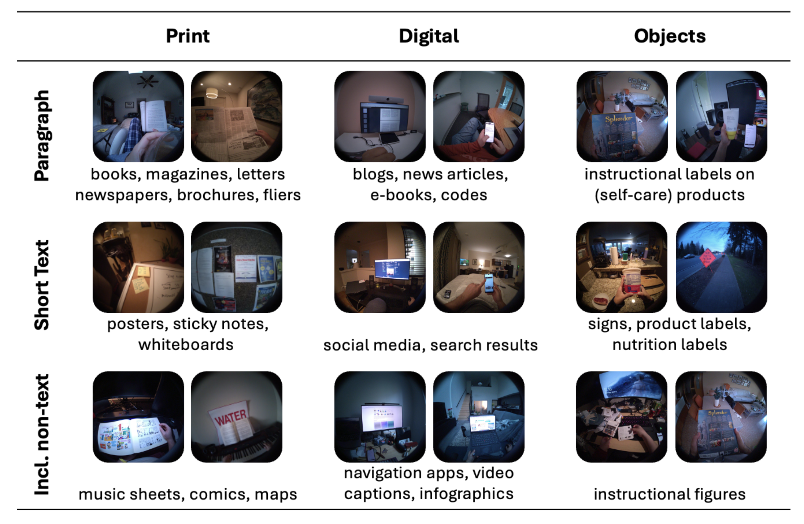
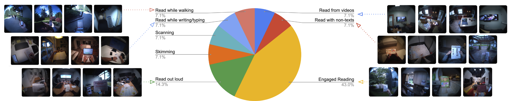

# Reading in the Wild - Seattle Subset
The Seattle subset emphasizes diversity, comprising 80 hours of data from 80 participants engaged in various reading and non-reading activities across multiple indoor and outdoor settings. The Seattle subset was collected for **training, validation, and testing purposes**. 

This dataset is owned and distributed by Meta under under the Creative Commons
Attribution-NonCommercial 4.0 International License
([CC BY-NC 4.0](https://creativecommons.org/licenses/by-nc/4.0/legalcode)). Data
and code may not be used for commercial purposes. For more information, please
refer to the [LICENSE](./LICENSE) file included in this repository.

<p align="center">

</p>

## Diverse Reading Materials and Reading Modes

As captured in the following table and the chart, our Seattle Subset features diverse reading materials and reading modes. Specifically, our dataset encompasses over 150 reading materials across various mediums and text lengths. The reading modes include engaged reading, skimming, scanning, reading out loud, and multi-tasking (e.g., while walking, writing, or typing). Additional statistics are available in our technical report. 

<p align="center">

</p>


<p align="center">

</p>

## Explore the data in ARIA Dataset Explorer
👀 You can preview the data and download selected sequences from the following link:

👉 [https://explorer.projectaria.com/ritw](https://explorer.projectaria.com/ritw)

## Accessing the Dataset
📦 Request accessing the dataset from the following link:

👉 [https://www.projectaria.com/datasets/reading-in-the-wild/#download-dataset](https://www.projectaria.com/datasets/reading-in-the-wild/#download-dataset)

## Downloading the Dataset
Please follow the instructions in [[Project Aria Doc/Download Datasets]](https://facebookresearch.github.io/projectaria_tools/docs/open_datasets/dataset_download)

### Option 1 - Download sample files.
Visit [dataset explorer](https://explorer.projectaria.com/ritw), click any
sequences for detailed view. On the right panel, locate a list of links to
download particular data groups for that sequence.

### Option 2 - Batch download multiple sequences.
For batch download, you need to obtain a JSON file with urls. There are two ways to achieve this. First, you can visit the
[project page](https://www.projectaria.com/datasets/reading_in_the_wild/), and sign up for
_Access the Dataset_ located at the bottom to be directed to the download page. The
downloaded file will contain the urls to the full dataset. Alternatively, you can
generate a customized JSON file with selected sequences and modalities on
[dataset explorer](https://explorer.projectaria.com/ritw). Either way, the urls provided by the JSON file is valid for 14
days. Please obtain a new JSON file upon expiration.

With the JSON file, you can visit the urls to download data as follows:

```
conda activate ritw
mkdir ${OUTPUT_FOLDER_PATH}
aria_dataset_downloader --cdn_file ${PATH_TO_YOUR_JSON_FILE} --output_folder ${OUTPUT_FOLDER_PATH} --data_types 6 7 8
```
This will download VRS files for all sequences in the CDN file to the specified output folder.
To overwrite existing files when downloading data, use the `--overwrite` flag. To download VRS files for specific sequences, specify their names after the `--sequence_names` argument.

**Download specific data groups**

You can download specific data groups, by specify their numbers separated by spaces after the --data_types argument.
```
6: recording_vrs  # This includes all sensor streams from the Project Aria glasses
7: metadata_json  # This includes metadata that encompasses labels for each sequence, as well as information on the train/validation/test split.
8: mps # This includes eye gaze, hand tracking, slam (calibration, trajectory, semi-dense point clouds)
```
For example, to download only the `metadata_json`, and `mps`, which corresponds to data groups 7 and 8 for all sequences, run the following command:

```
aria_dataset_downloader --cdn_file ${PATH_TO_YOUR_JSON_FILE} --output_folder ${OUTPUT_FOLDER_PATH} --data_types 7 8
```


## Loading the Data with Visualization
To visualize gaze trajectories and the foveated patch on RGB frames, follow the example in the Jupyter notebook found here: [playground.ipynb](https://github.com/facebookresearch/reading_in_the_wild/tree/main/reading_in_the_wild_seattle/playground.ipynb).


## Additional Resources
For more details on data format and additional methods for visualizing and interacting with the data, please refer to the following resources:
- [Project Aria Tools GitHub Repository](https://github.com/facebookresearch/projectaria_tools)
- [Project Aria Tools Wiki](https://facebookresearch.github.io/projectaria_tools/docs/intro)